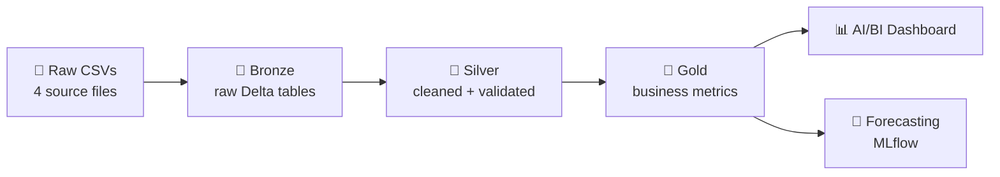

# 🇸🇬 Singapore Individual Income Trends, 2004-2025

**An end-to-end Databricks lakehouse project: from raw open data to dashboards and forecasts**

[Overview](#-overview) •
[Architecture](#-architecture) •
[Data](#-data) •
[Insights](#-key-insights) •
[ML](#-forecasting) •
[Run it](#-how-to-run) •
[Limitations](#-limitations)

---

## 📌 Overview

This project explores more than 20 years of Singapore individual income tax data. It ingests four open datasets, cleans and models them using the **medallion architecture** (bronze → silver → gold) on **Databricks** with **Unity Catalog**, and turns them into analytics, a dashboard, and a simple forecast.

**Questions this project answers:**

- 📈 How has total and average individual income grown over time?
- 💼 How has the income mix shifted (employment vs dividends vs trade vs rent)?
- ⚖️ How do the **taxable** and **non-taxable** groups compare?
- 🎁 How have donations changed relative to income?
- 🔮 Where might income and the number of assessed individuals be heading next?

**At a glance (2004 → 2025):**

| Metric | 2004 | 2025 | Change |
|---|---|---|---|
| Individuals assessed | 1.73M | 3.08M | ~1.8x |
| Total income | 71.9M* | 285.0M* | ~4.0x |

*Raw units as published. Check the source page for the unit (likely thousands of dollars).

---

## 🏗️ Architecture

| Layer | What happens |
|---|---|
| 🥉 **Bronze** | Raw CSVs loaded as-is into Unity Catalog Delta tables |
| 🥈 **Silver** | Income types standardised, types enforced, reconciliation checks applied |
| 🥇 **Gold** | Analytics-ready tables: average income, income mix, YoY growth, group comparisons |

---

## 📂 Data

Source: Singapore individual income tax statistics (open data). *Add the dataset link and licence here.*

| Dataset | Grain | Rows |
|---|---|---|
| `Assessable_Income_of_Individuals` | Year | 22 |
| `Assessable_Income_of_Individuals_by_Tax_Group` | Year × tax group | 44 |
| `Income_of_Individuals_by_Income_Type` | Year × income type | 154 |
| `Income_of_Individuals_by_Income_Type_and_Tax_Group` | Year × tax group × income type |
