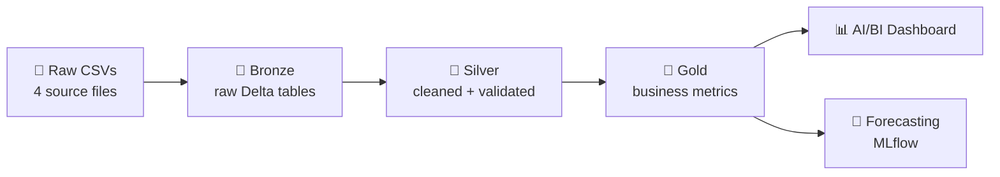

<div align="center">

# 🇸🇬 Singapore Individual Income Trends, 2004-2025

**An end-to-end Databricks lakehouse project: from raw open data to dashboards and forecasts**


[Overview](#overview) •
[Architecture](#architecture) •
[Data](#data) •
[Insights](#key-insights) •
[ML](#forecasting) •
[Run it](#how-to-run) •
[Limitations](#limitations)

</div>

---

<a id="overview"></a>

## 📌 Overview

This project explores more than 20 years of Singapore individual income tax data. It ingests four open datasets, cleans and models them using the **medallion architecture** (bronze → silver → gold) on **Databricks** with **Unity Catalog**, and turns them into analytics, a dashboard, and a simple forecast.

**Questions this project answers:**

- 📈 How has total and average individual income grown over time?
- 💼 How has the income mix shifted (employment vs dividends vs trade vs rent)?
- ⚖️ How do the **taxable** and **non-taxable** groups compare?
- 🎁 How have donations changed relative to income?
- 🔮 Where might income and the number of assessed individuals be heading next?

**At a glance (2004 → 2025):**

| Metric | 2004 | 2025 | Change |
|---|---|---|---|
| Individuals assessed | 1.73M | 3.08M | ~1.8x |
| Total income | 71.9M* | 285.0M* | ~4.0x |

<sub>*Raw units as published. Check the source page for the unit (likely thousands of dollars).</sub>

---

<a id="architecture"></a>

## 🏗️ Architecture



| Layer | What happens |
|---|---|
| 🥉 **Bronze** | Raw CSVs loaded as-is into Unity Catalog Delta tables |
| 🥈 **Silver** | Income types standardised, types enforced, reconciliation checks applied |
| 🥇 **Gold** | Analytics-ready tables: average income, income mix, YoY growth, group comparisons |

---

<a id="data"></a>

## 📂 Data

Source: Singapore individual income tax statistics (open data). *Add the dataset link and licence here.*

| Dataset | Grain | Rows |
|---|---|---|
| `Assessable_Income_of_Individuals` | Year | 22 |
| `Assessable_Income_of_Individuals_by_Tax_Group` | Year × tax group | 44 |
| `Income_of_Individuals_by_Income_Type` | Year × income type | 154 |
| `Income_of_Individuals_by_Income_Type_and_Tax_Group` | Year × tax group × income type | 308 |

**Coverage:** Years of Assessment 2004 to 2025.

### 🧹 Data quality handling

- **Label harmonisation:** `Rents/ Net Annual Value` (2004-2009) and `Rent` (2010 onward) are the same income type, so they are mapped to a single `Rent` category to avoid a false break in trends.
- **Reconciliation checks:** income types sum to total income (within ±2 rounding) and tax groups sum to overall totals.
- **Null and duplicate checks:** no nulls or duplicate keys found.

---

<a id="key-insights"></a>

## 💡 Key Insights

> 📝 *Fill these in after running your analysis, and add screenshots to `images/`.*

- **Growth:** _e.g. total income grew ~4x between 2004 and 2025_
- **Income mix:** _e.g. employment income remains the largest share_
- **Tax groups:** _e.g. taxable vs non-taxable average income gap_
- **COVID effect:** _e.g. growth slowed noticeably around YA 2020-2021_
- **Donations:** _e.g. donations as a % of total income over time_

### 📊 Dashboard

<!-- Replace with your own screenshots -->
<p align="center">
  
</p>

<p align="center">
  
  
</p>

---

<a id="forecasting"></a>

## 🔮 Forecasting

With only 22 annual data points, the goal is **sound methodology rather than complexity**.

- Simple models (linear trend, exponential smoothing) with prediction intervals
- Experiments tracked and compared in **MLflow**
- Anomaly flags on year-over-year growth to highlight unusual years

> ⚠️ Forecasts are illustrative. Small samples and structural shocks (like COVID) limit reliability.

---

## 📁 Repository Structure

```
singapore-income-databricks/
├── README.md
├── notebooks/
│   ├── 01_bronze_ingestion.py
│   ├── 02_silver_cleaning.py
│   ├── 03_gold_metrics.py
│   ├── 04_eda_and_insights.py
│   └── 05_forecasting_mlflow.py
├── data/                  # raw CSVs (public open data)
├── images/                # dashboard and chart screenshots
└── .gitignore
```

---

<a id="how-to-run"></a>

## 🚀 How to Run

1. **Clone** this repo into Databricks as a **Git folder** (Workspace → Create → Git folder).
2. **Upload the CSVs** to a Unity Catalog Volume, e.g. `/Volumes/<catalog>/<schema>/raw_income/`.
3. **Update the catalog and schema names** at the top of each notebook (`my_catalog.my_schema`).
4. **Run the notebooks in order**, `01` → `05`.
5. *(Optional)* Schedule them as a **Lakeflow Job** for an automated pipeline.

**Requirements:** a Databricks workspace with Unity Catalog enabled (Free Edition works).

---

## 🛠️ Tech Stack

- **Databricks** (notebooks, Unity Catalog, AI/BI dashboards, Lakeflow Jobs)
- **PySpark** and **Spark SQL**
- **Delta Lake**
- **MLflow** for experiment tracking
- **Python** (pandas, scikit-learn / statsmodels)

---

<a id="limitations"></a>

## ⚠️ Limitations

- Data is **aggregated annual**, so no individual-level analysis is possible.
- **22 data points** limit forecast accuracy.
- Figures are in the units published by the source; check the source page before quoting absolute values.
- This is a learning and portfolio project, not official analysis.

---

## 🔭 Future Ideas

- [ ] Add inflation adjustment for real income trends
- [ ] Join with other open datasets (e.g. population, wages)
- [ ] Automate ingestion with Auto Loader
- [ ] Add data quality expectations with Lakeflow pipelines

---

## 🙏 Acknowledgements

Data provided by the data.gov.sg link: https://data.gov.sg/datasets?query=iras&resultId=271. Built as a personal learning project on Databricks.

<div align="center">

**If you found this useful, give it a ⭐**

</div>
